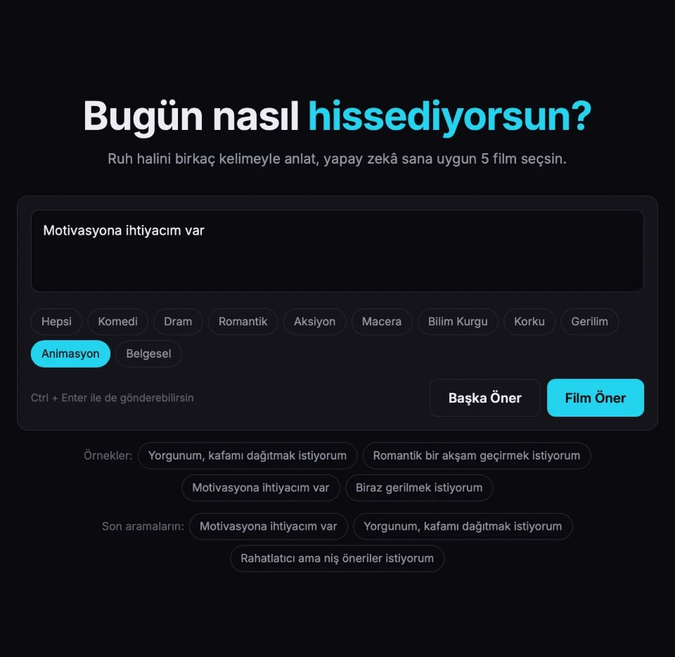
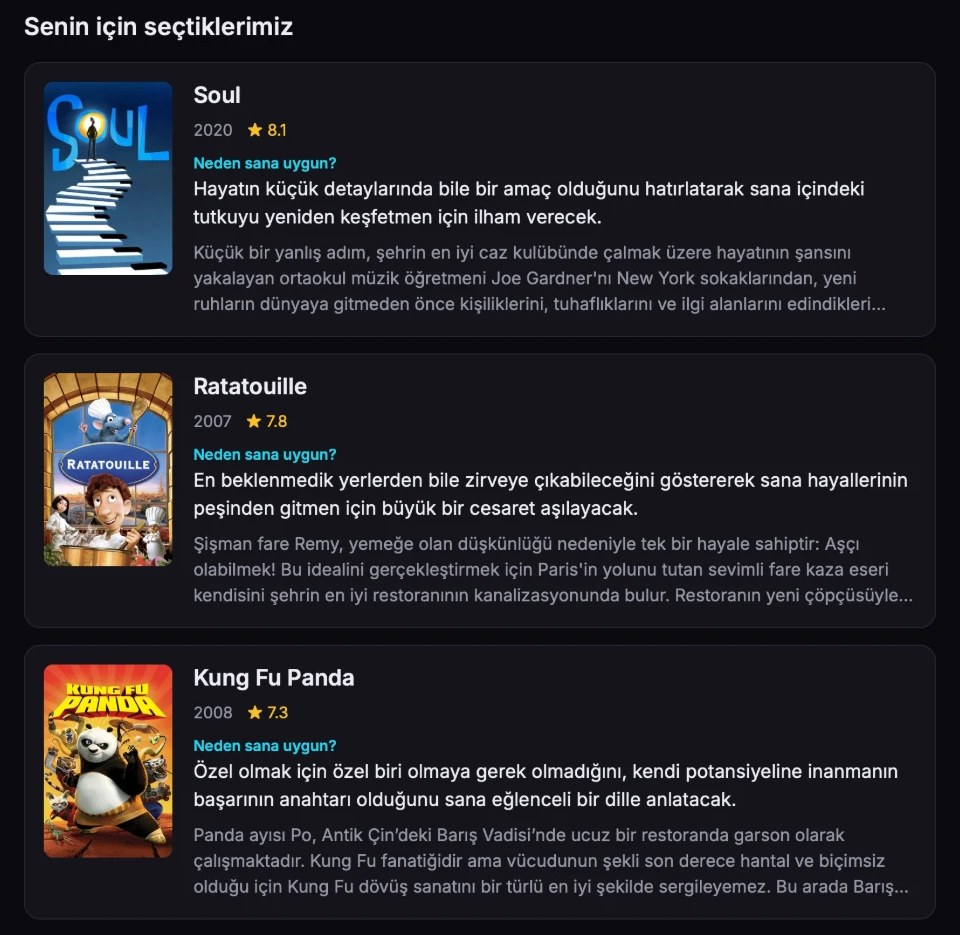

# ReelFeel

Ruh haline göre film öneren bir web sitesi. Nasıl hissettiğini yazıyorsun, yapay zekâ sana uygun 5 film seçiyor ve her birinin neden uygun olduğunu söylüyor.

Site: https://reelfeel.onrender.com

 

## Özellikler

- Ruh halini serbest metinle yazma
- Gemini ile 5 film önerisi ve kısa açıklamaları
- TMDB'den afiş, puan ve konu özeti
- Türe göre filtreleme
- "Başka Öner" ile aynı ruh hali için farklı filmler
- Son aramaları hatırlama

## Kullandıklarım

- Java 21, Spring Boot
- HTML, CSS, JavaScript
- Google Gemini API
- TMDB API
- Maven, JUnit
- Render (yayınlamak için)

## Nasıl çalışıyor?

Sayfa, yazılan metni Spring Boot sunucusuna gönderiyor. Sunucu Gemini'den JSON formatında 5 film istiyor, sonra her filmi TMDB'de arayıp afişini ve konusunu buluyor. API anahtarları sadece sunucuda duruyor.

Film bilgileri ve afişler [TMDB](https://www.themoviedb.org/)'den alınmıştır.
